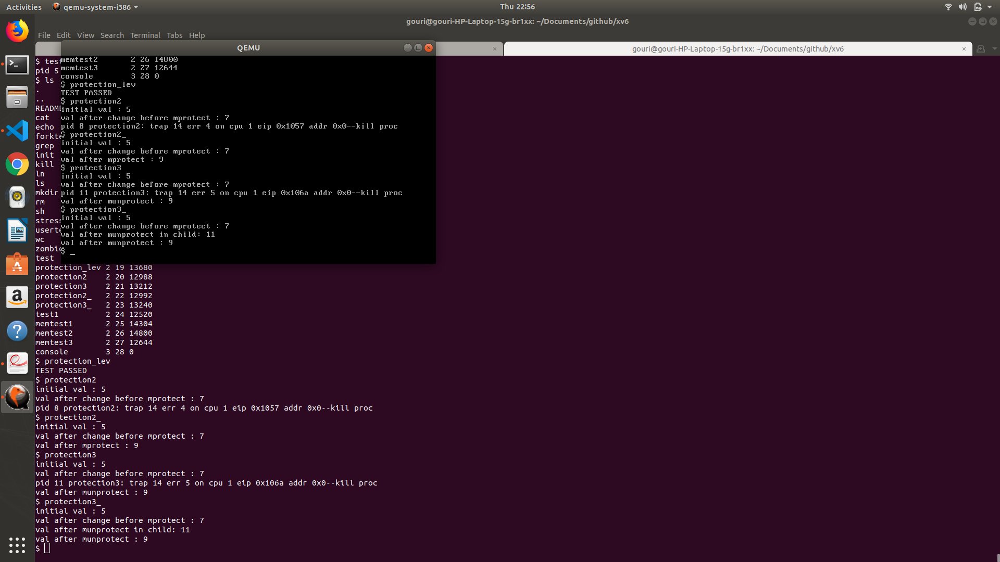

# xv6

Name : Gouri Nangliya 
MIS : 111703018

## Problem Statement

Add this feature to xv6 memory management capabilities: cause an exception to occur when your program dereferences a null pointer, and adding the ability to change the protection levels of some pages in a process's address space.
https://github.com/remzi-arpacidusseau/ostep-projects/tree/master/vm-xv6-intro

## Null pointer dereference

Changed files :

exec.c
vm.c 
Makefile
syscall.c 

Test file : 

test.c, test1.c:
    output should be trap 14 which is page fault which dereferencing null pointer.
    
Screenshot of output of test.c and test1.c :

## Changing PL of same pages in process's address space

Changed files :

syscall.c
proc.c
usys.S
user.h
sysproc.c
syscall.h
defs.h

Test file : 

protection_level_test.c
    code for is mprotect and munprotect return correct values for various cases.
    ouput should be "TEST PASSED"

protection2.c
    changing global variable before mprotect which should print its value and after mprotect which should cause trap.

protection2_.c
    changing global variable before mprotect which should print its value and after mprotect and munprotect and again printing its value.

protection3.c
    changing global variable before mprotect which should print its value and after mprotect, fork the process and change the value in child which should cause trap.

protection3_.c
    changing global variable before mprotect which should print its value and after mprotect, fork the process and munprotect in child, change the value in child and printing its value.

Screenshot of output of all above :

## How to run

qemu and git is required to run this. Please install them before proceeding further.

1. Clone this repository using 

`git clone git@github.com:clue1ess/xv6.git`

2. `cd xv6` 

3. Run `make clean`

4. Run `make`

5. Run `make qemu`

6. Terminal will appear
    For test files output, these are names of executable files :
    1. test
    2. test1
    3. protection_lev
    4. protection2
    5. protection2_
    6. protection3
    7. protection3_

## Theory

I tried to write xv6 explanations which spans over three files:

1. os_theory.md - explained basic and important os concepts required to understand xv6
2. explantion_xv6.md - detailed explanation of xv6 (not everything!)
3. functions_xv6.md - list of all functions with their functionality and signature

## Demand paging + swapping

I implemented demand paging and swapping in xv6. The core logic is taken from https://github.com/RhythmIIITD/AOS-Demand-Paging/blob/master/proj.pdf.
For implementation purpose, I referred to following github repos and I did look into the code, so has something similiar to them :

1. https://github.com/RhythmIIITD/AOS-Demand-Paging
2. https://github.com/vshan/xv6p
3. https://github.com/Systems-IIITD/xv6-paging
4. https://github.com/bhupesh17040/xv6-Memory-Management

But my implementation uses less no of bits (for representing flags in  page entry) and also in a different way than all of these repos. Also, implementation of algorithm for selecting a victim is different.

The main intent behind this is to understand how demand paging and swapping is implemented as concept is easy to understand but challenging to implement!

Outputs :

